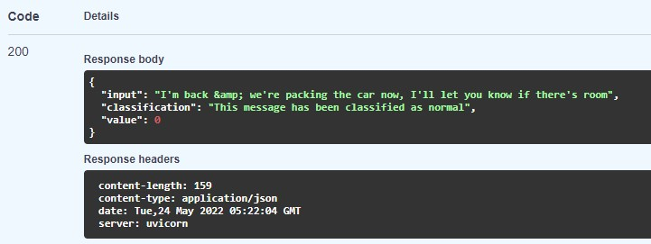
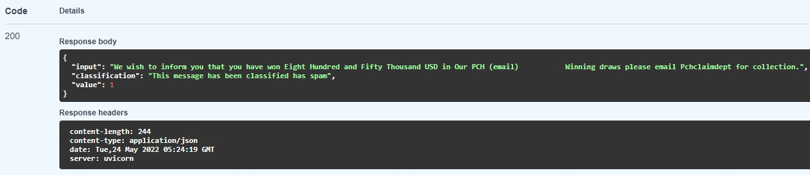

# DEPLOYMENT OF NLP MODEL USING FASTAPI AND DOCKER

This project involves three different processes:

1. Building an NLP model using DistilBert (an optimized and lighter version of BERT) to classify emails as spam/normal
2. Build the backend using FastAPI to serve the predictions of the model through an endpoint
3. Containerize the application using docker for easier deployment

## 1. Building the model

The model was built using pytorch. Using distilbert as the foundation, I imported both tokenizer and base model. Then, I added the following layers:  
Fully connected -> ReLU -> Dropout -> Fully connected.

First, I trained the model freezing the weights of the base distilbert model, so the upper layers could converge.
Finally, I set **param.requires_grad = True** to train the all the layers for this specific task.
After the training phase, I saved the model's parameters.

## 2. Building the backend with FastAPI

The advantage of FastAPI is its excellent documentation and Interactive API docs to test the endpoints.
We need to install the required packages to load our previously trained model with its weights and declare the endpoint that we will use for inference.

## 3. Creater Dockerfile and docker-compose

The last part is creating the image with the require packages and CMD commands to start the application. I also generated the docker-compose file for easier deployment.

## 4. Final Results

When the container is deployed, you can go to http://localhost:8000/docs and input the email into the endpoint named **inference**

